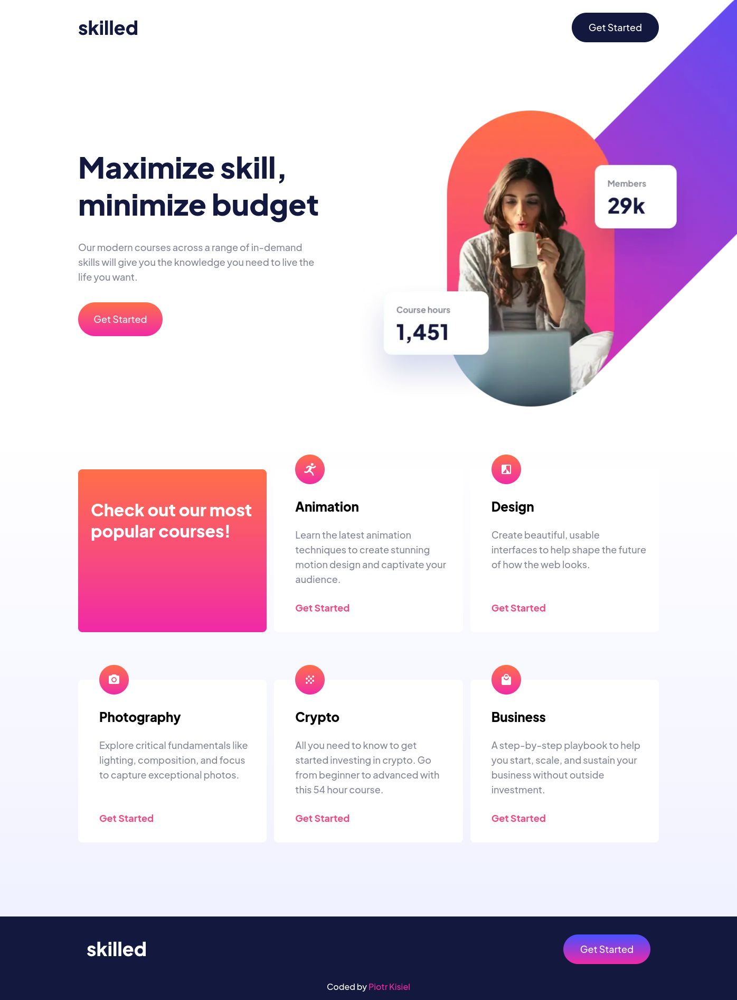
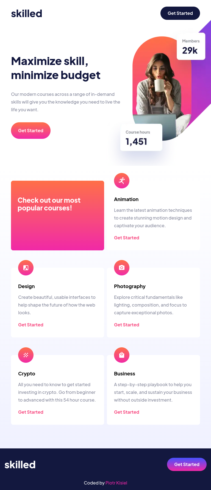
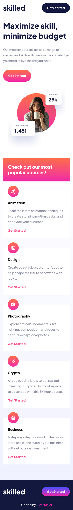

# Frontend Mentor - Skilled e-learning landing page solution

# [Live view](https://pietyr.github.io/skilled-elearning-landing-page/)

This is a solution to the [Skilled e-learning landing page challenge on Frontend Mentor](https://www.frontendmentor.io/challenges/skilled-elearning-landing-page-S1ObDrZ8q).

## Table of contents

- [Overview](#overview)
  - [The challenge](#the-challenge)
  - [Screenshots](#screenshots)
    - [Desktop](#desktop)
    - [Tablet](#tablet)
    - [Mobile](#mobile)
  - [Links](#links)
- [My process](#my-process)
  - [Built with](#built-with)
- [Author](#author)

## Overview

### The challenge

Users should be able to:

- View the optimal layout depending on their device's screen size
- See hover states for interactive elements

### Screenshots

#### Desktop

Screen width: 1440px

#### Tablet

Screen width: 768px

#### Desktop

Screen width: 375px

### Links

- Source Code: [GitHub](https://github.com/pietyr/skilled-elearning-landing-page)
- Live Site: [GitHub Pages](https://pietyr.github.io/skilled-elearning-landing-page/)
- Challenge solution: [Frontend Mentor](#TODO)

## My process

### Built with

- Semantic HTML5 markup
- SASS
- Flexbox
- Mobile-first workflow

## Author

- Frontend Mentor - [@pietyr](https://www.frontendmentor.io/profile/pietyr)
- Github - [@pietyr](https://github.com/pietyr)
